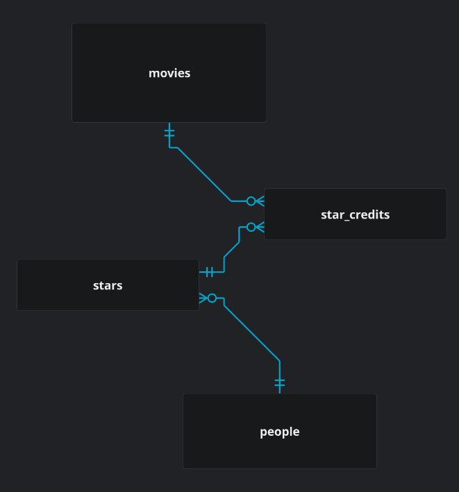
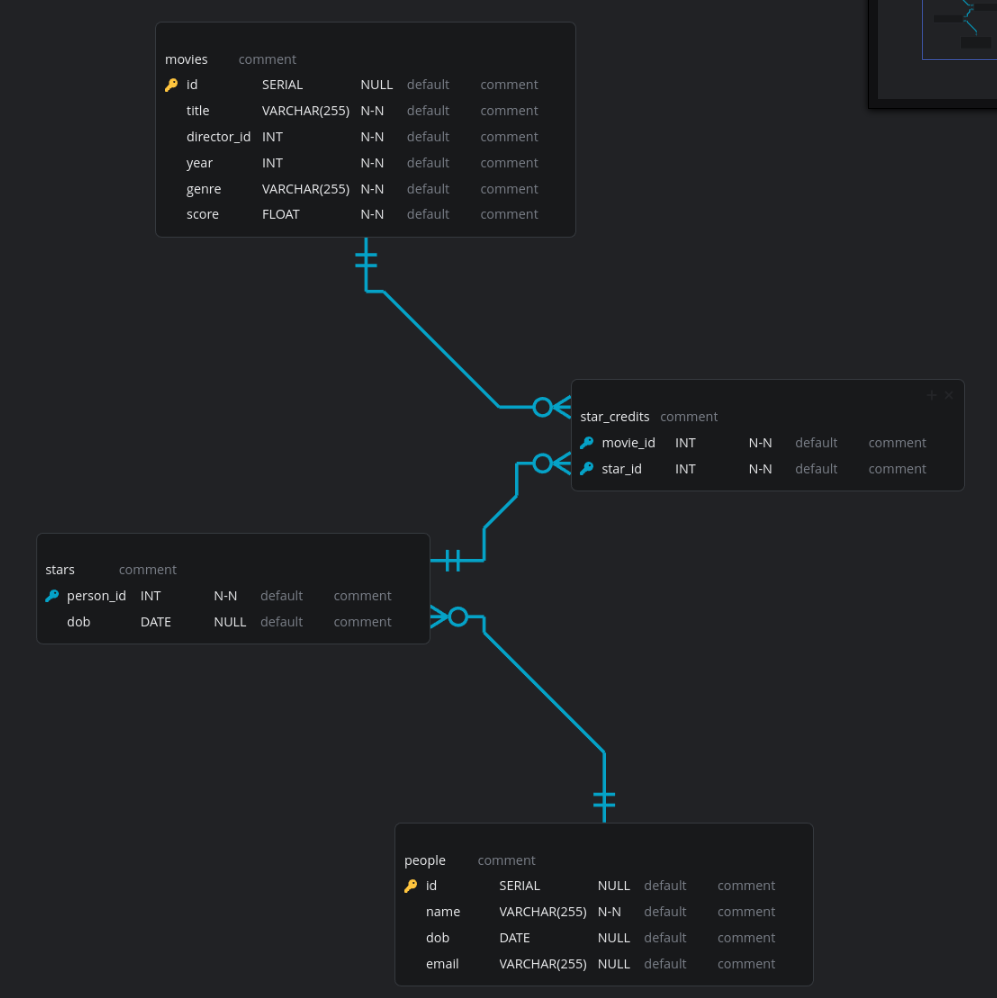
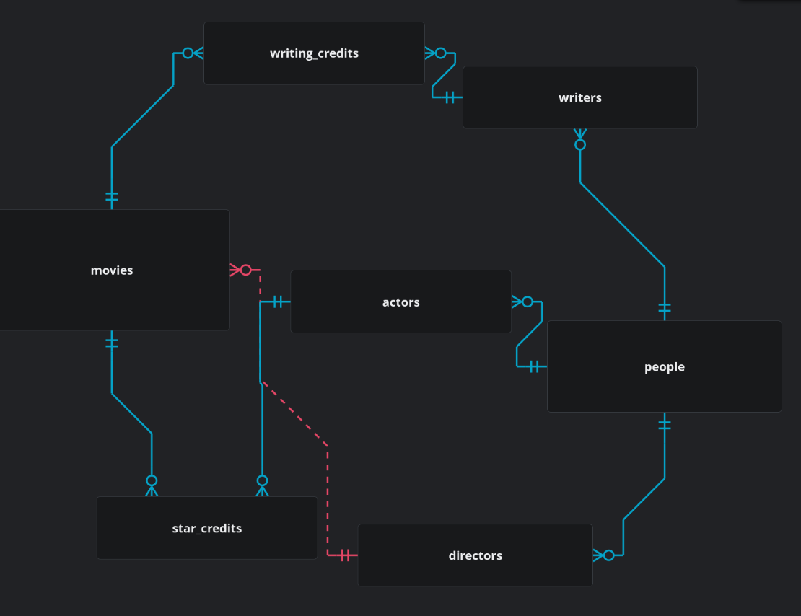
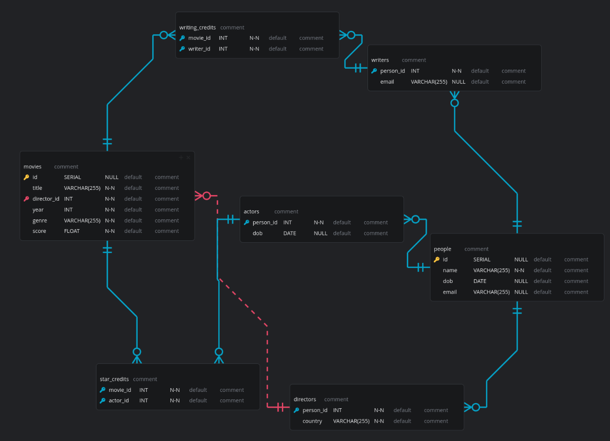

### Csharp-apis-sql-relations-and-joins

### Data

| ID  | Title                 | Director               | Director Country | Star              | Star DOB   | Writer                   | Writer Email          | Year | Genre           | Score |
| --- | --------------------- | ---------------------- | ---------------- | ----------------- | ---------- | ------------------------ | --------------------- | ---- | --------------- | ----- |
| 1   | 2001: A Space Odyssey | Stanley Kubrick        | USA              | Keir Dullea       | 30/05/1936 | Arthur C Clarke          | arthur@clarke.com     | 1968 | Science Fiction | 10    |
| 2   | Star Wars: A New Hope | George Lucas           | USA              | Mark Hamill       | 25/09/1951 | George Lucas             | george@email.com      | 1977 | Science Fiction | 7     |
| 3   | To Kill A Mockingbird | Robert Mulligan        | USA              | Gregory Peck      | 05/04/1916 | Harper Lee               | harper@lee.com        | 1962 | Drama           | 10    |
| 4   | Titanic               | James Cameron          | Canada           | Leonardo DiCaprio | 11/11/1974 | James Cameron            | james@cameron.com     | 1997 | Romance         | 5     |
| 5   | Dr Zhivago            | David Lean             | UK               | Julie Christie    | 14/04/1940 | Boris Pasternak          | boris@boris.com       | 1965 | Historical      | 8     |
| 6   | El Cid                | Anthony Mann           | USA              | Charlton Heston   | 04/10/1923 | Frederick Frank          | fred@frank.com        | 1961 | Historical      | 6     |
| 7   | Voyage to Cythera     | Theodoros Angelopoulos | Greece           | Manos Katrakis    | 14/08/1908 | Theodoros Angelopoulos   | theo@angelopoulos.com | 1984 | Drama           | 8     |
| 8   | Soldier of Orange     | Paul Verhoeven         | Netherlands      | Rutger Hauer      | 23/01/1944 | Erik Hazelhoff Roelfzema | erik@roelfzema.com    | 1977 | Thriller        | 8     |
| 9   | Three Colours: Blue   | Krzysztof Kieslowski   | Poland           | Juliette Binoche  | 09/03/1964 | Krzysztof Kieslowsk      | email@email.com       | 1993 | Drama           | 8     |
| 10  | Cyrano de Bergerac    | Jean-Paul Rappeneau    | France           | Gerard Depardieu  | 27/12/1948 | Edmond Rostand           | edmond@rostand.com    | 1990 | Historical      | 9     |


### ERD




### DB structure
```SQL
CREATE TABLE movies (
  title VARCHAR(255) NOT NULL,
  director_id INT NOT NULL,
  year INT NOT NULL,
  genre VARCHAR(255) NOT NULL,
  score FLOAT NOT NULL,
  id SERIAL PRIMARY KEY
);


CREATE TABLE directors (
  name VARCHAR(255) NOT NULL,
  country VARCHAR(255) NOT NULL,
  email VARCHAR(255) UNIQUE,
  id SERIAL PRIMARY KEY
);

CREATE TABLE stars (
  name VARCHAR(255) NOT NULL,
  dob DATE NOT NULL,
  id SERIAL PRIMARY KEY
);


CREATE TABLE writers (
  name VARCHAR(255) NOT NULL,
  email VARCHAR(255) UNIQUE,
  id SERIAL PRIMARY KEY
);


CREATE TABLE writing_credits (
  movie_id INT REFERENCES movies(id),
  writer_id INT REFERENCES writers(id)
);

```
### SQL Queries

``` SQL
SELECT movies.title, directors.name
FROM movies
INNER JOIN directors ON movies.director_id = directors.id;

SELECT movies.title, directors.name, stars.name
FROM movies
INNER JOIN directors ON movies.director_id = directors.id
INNER JOIN stars ON movies.id = stars.id;

SELECT movies.title
FROM movies
INNER JOIN directors ON movies.director_id = directors.id
WHERE directors.country = 'USA';


SELECT movies.title
FROM movies
JOIN writing_credits ON movies.id = writing_credits.movie_id
JOIN directors ON writing_credits.writer_id = directors.id
INNER JOIN writers ON directors.name = writers.name;


SELECT movies.director_id, directors.name, movies.title
FROM movies
JOIN directors ON movies.director_id = directors.id
WHERE movies.score >= 8;

```

### Some additional

``` SQL

SELECT directors.name, AVG(movies.score) AS average_rating
FROM directors
JOIN movies ON movies.director_id = directors.id
GROUP BY directors.name;

SELECT movies.genre, COUNT(movies.id) AS number_of_films
FROM movies
GROUP BY movies.genre;

```

### Extension 1






### Refactored Queries

``` SQL

SELECT movies.title, directors.name
FROM movies
INNER JOIN directors ON movies.director_id = directors.id;

SELECT movies.title, directors.name, stars.name
FROM movies
INNER JOIN directors ON movies.director_id = directors.id
INNER JOIN star_credits ON movies.id = star_credits.movie_id
INNER JOIN actors ON star_credits.actor_id = actors.id;

SELECT movies.title
FROM movies
INNER JOIN directors ON movies.director_id = directors.id
WHERE directors.country = 'USA';

SELECT movies.title
FROM movies
JOIN writing_credits ON movies.id = writing_credits.movie_id
JOIN directors ON writing_credits.writer_id = directors.id
INNER JOIN writers ON directors.name = writers.name;

SELECT movies.title
FROM movies
JOIN writing_credits ON movies.id = writing_credits.movie_id
JOIN directors ON writing_credits.writer_id = directors.id
INNER JOIN writers ON directors.name = writers.name;

SELECT movies.director_id, directors.name, movies.title
FROM movies
JOIN directors ON movies.director_id = directors.id
WHERE movies.score >= 8;

```
## Extension 2

```SQL

CREATE MATERIALIZED VIEW Cast AS
SELECT
  m.title AS movie_title,
  a.name AS actor_name,
  a.dob AS actor_dob
FROM actors a
JOIN star_credits sc ON a.person_id = sc.actor_id
JOIN movies m ON sc.movie_id = m.id;

```
To refresh this view with the latest data.
``` SQL
REFRESH MATERIALIZED VIEW cast;
```

